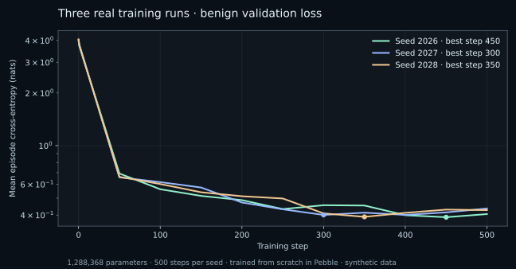

# Pebble Sentinel PAL Transformer model card

A from-scratch **1,288,368-parameter** decoder-only model for experimental agent-action anomaly scoring. It is a distinct behavior model, not the existing two-million-parameter character PebbleLM and not a conversational assistant. Model source, original generated data and trained weights are MIT.

## Architecture and training

| Property | Value |
|---|---|
| Vocabulary | 51 closed word-level PAL tokens |
| Context | 256 tokens |
| Transformer layers | 5 |
| Width / heads / head width | 144 / 4 / 36 |
| Feed-forward width | 576, tanh GELU |
| Normalization | Pre-LN, non-affine, epsilon 1e-5; final non-affine LN |
| Embeddings | Learned token and position; tied output |
| Biases / dropout | None / none |
| Parameter tensors | 22; tokens 7,344 + positions 36,864 + blocks 1,244,160 |
| Initialization | Seeded Gaussian 0.02; attention/output residual projections scaled by sqrt(2 × layers) |
| Optimizer | AdamW, betas 0.9/0.95, decay 0.01, clip global gradient norm 1 |
| Schedule | Peak 0.0015, 25-step warm-up, cosine to 10% of peak |
| Batch / steps / tokens per run | 2 × 256 / 500 / 256,000 supervised next-token positions |
| Actual seeds | 2026, 2027, 2028 |
| Selection | Lowest 36-episode benign validation loss; default seed 2026 chosen before attack evaluation |

Generator, tokenizer, Transformer and the training schedule/loop are Pebble programs. TensorFlow.js/WASM supplies CPU tensor kernels and automatic differentiation; Pebble host primitives perform AdamW numerical updates. Python/NumPy is the numerical deployment scorer and evaluator, not a substitute trainer. Training started from new random weights; no text-LM checkpoint, real user trace or attack label was used to train the model.

The scorer computes max next-token negative log probability in bits over an action, conditioned on up to the last 256 past tokens. Exact-prefix KV caching agrees with a full reference; shifted windows are rebuilt because absolute positions change. Exported Pebble token-loss fixtures also agree with NumPy, including >256-token rollover. All position embeddings receive supervised gradients in full-length packed training batches; there are no dummy padding parameters to inflate the count.

## Actual evaluation

| System | F1 | F2 | F3 | F4 | F5 | False alarms / 1,000 benign actions | Short-episode p95 ms |
|---|---:|---:|---:|---:|---:|---:|---:|
| B0 · Rules | 2/2 | 1/1 | 1/1 | 1/1 | 1/1 | 34.727 | 0.009 |
| B1 · Trigram | 1/2 | 1/1 | 0/1 | 1/1 | 0/1 | 0.000 | 0.006 |
| B2 · Transformer | 2/2 | 1/1 | 1/1 | 1/1 | 1/1 | 9.613 | 2.039 |
| B3 · Transformer + rules | 2/2 | 1/1 | 1/1 | 1/1 | 1/1 | 44.340 | 2.167 |

Short scorer p95 2.039 ms over 10,000 measured calls; mature 256-token scorer p95 48.387 ms over 1,000. Timing excludes cold start, network and audit I/O. See [full measured results](results/METRICS.md) for stage definitions, all three seeds and every operating point.

## Intended use and limitations

Use for local research, shadow-mode observation and demonstrations of typed behavior monitoring. The human-readable PAL abstraction excludes document content and raw secrets, making decisions explainable. Hard rules remain the backbone. This is not a sandbox, security certification, general LLM or guarantee of safety.

Synthetic workflows share motifs and repeat heavily; only 129 distinct calibration context/action pairs support the thresholds. The nominal 0.1%/0.01% calibration rates do not generalize to unseen legitimate templates: default model test flags 9.613/1,000 and full-system flags 44.340/1,000. Several benign interpreter/delegation actions conflict with cautious hard rules. All six authored episodes are already caught by the rule pack; the model does not demonstrate necessity or superior protection at equal false-alarm rates. Trigram catches fewer authored attacks but has lower false alarms. Perfect mimicry, encoding errors, trusted-host exfiltration and actions bypassing the adapter remain weaknesses.

The under 5 ms total p95 target fails for exact mature windows. Real-user traces, poisoning resistance, parameter/context sweeps and taint ablations were not evaluated. The separate upstream Hermes adapter routing smoke test is not a live-agent model-quality evaluation.

## Reproduction and release

See [training instructions](model/README.md), [data card](DATA_CARD.md), [evaluation protocol](eval/README.md) and [SHA-256 provenance](results/provenance.json). Checkpoints for all three actual seeds, original templates/data, loss histories, calibration, attack scores, raw latency samples and measured results are committed. Node 24 and Python 3.12 were used on an Apple M5 Pro CPU. Dependency licenses retain their terms; all authored artifacts are MIT. AI assisted implementation and evaluation; no generated metric was accepted without executing the corresponding experiment.

